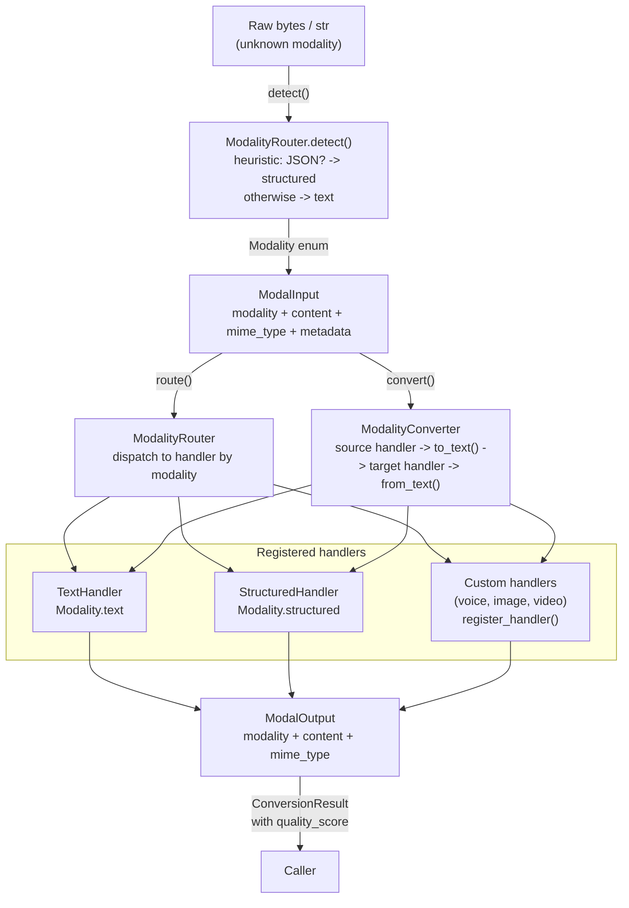

# aumai-modality

**Route, detect, and convert agent inputs across text and structured modalities.**

[](https://github.com/aumai/aumai-modality/actions)
[](https://pypi.org/project/aumai-modality/)
[](LICENSE)
[](https://python.org)

---

## What is this?

Think of `aumai-modality` as the **switchboard operator** for your agent's input pipeline.

A switchboard operator receives calls of many different kinds — voice, data, fax — and
routes each one to the right desk in the right format. `aumai-modality` does the same for
agent inputs: it accepts a payload in one modality (plain text, structured JSON, voice
bytes, image bytes), figures out what it is, routes it to the right handler, and can
convert it to whatever format downstream processing requires.

The system is built around three concepts:

1. **Modalities** — the supported payload types: `text`, `structured`, `voice`, `image`, `video`.
2. **Handlers** — modality-specific processors that normalize inputs and translate between formats. Text and structured handlers ship out of the box; voice, image, and video handler slots are ready to be filled by your own implementations.
3. **Converter** — a two-step bridge that can take any input modality and produce any target modality by routing through an intermediate text representation.

The design is extensible by intent. Plug in a whisper-based `VoiceHandler`, a CLIP-based
`ImageHandler`, or a custom `VideoHandler`, and the converter and router work with them
automatically.

---

## Why does this matter?

Modern AI agents increasingly need to handle inputs that are not plain text. Users speak to
voice interfaces. Pipelines pass JSON payloads. Vision models receive images. But most
agent orchestration code is written assuming a single input format. When the format
changes, the plumbing breaks.

`aumai-modality` provides a **thin, stable abstraction layer** so your agent logic never
has to know which wire the data came in on. The agent receives a `ModalInput`, calls
`route()` or `convert()`, and gets back a normalized `ModalOutput`. The handler swap is
transparent.

Additional benefits:
- **Auto-detection** — `ModalityRouter.detect()` heuristically identifies whether raw bytes
  are plain text or structured JSON without you having to pass a type hint.
- **Quality scoring** — `ConversionResult.quality_score` tells you how much information
  fidelity was preserved in a conversion, so callers can make informed decisions about
  fallback handling.
- **Extensibility** — add a new modality by subclassing `ModalityHandler` and registering
  it; no changes to the converter or router.

---

## Architecture



### Component responsibilities

| Component | Responsibility |
|---|---|
| `ModalityRouter` | Dispatches a `ModalInput` to the correct handler; auto-detects modality from raw bytes |
| `ModalityConverter` | Two-step conversion: source → text → target; uses `quality_score` to report fidelity |
| `TextHandler` | Processes `Modality.text` inputs; handles bytes-or-str content |
| `StructuredHandler` | Processes `Modality.structured` JSON inputs; wraps non-JSON text in `{"text": ...}` envelope |
| `ModalityHandler` | Abstract base for custom handlers; subclass and implement `handle`, `to_text`, `from_text` |

---

## Features

- **Two built-in handlers** — `TextHandler` and `StructuredHandler` cover the most common agent I/O formats
- **Heuristic modality detection** — `ModalityRouter.detect()` identifies JSON payloads automatically
- **Lossless text-structured conversion** — quality score 0.95 (near-lossless round-trip)
- **Extensible handler registry** — plug in any `ModalityHandler` subclass with `register_handler()`
- **Quality scoring** — `ConversionResult.quality_score` is `1.0` for same-modality, `0.95` for text/structured, `0.5` for unregistered pairs
- **MIME type inference** — CLI automatically infers MIME type from file extension
- **Bytes and str support** — all handlers accept either `bytes` or `str` content transparently
- **Pydantic v2 models** — all data structures are validated, serializable, and type-safe
- **Lightweight** — no ML dependencies required for text and structured modalities

---

## Quick Start

### Installation

```bash
pip install aumai-modality
```

Or from source:

```bash
git clone https://github.com/aumai/aumai-modality
cd aumai-modality
pip install -e ".[dev]"
```

### Python API — 30-second example

```python
from aumai_modality.core import ModalityConverter, ModalityRouter
from aumai_modality.models import ModalInput, Modality

# Detect and route a plain-text input
router = ModalityRouter()
detected = router.detect("Hello, world!")
print(detected)  # Modality.text

modal_input = ModalInput(modality=detected, content="Hello, world!")
output = router.route(modal_input)
print(output.content)   # "Hello, world!"
print(output.mime_type) # "text/plain"

# Convert from text to structured JSON
converter = ModalityConverter()
json_input = ModalInput(modality=Modality.text, content="some plain text")
result = converter.convert(json_input, Modality.structured)
print(result.output.content)     # '{\n  "text": "some plain text"\n}'
print(result.quality_score)      # 0.95
```

### CLI — 30-second example

```bash
# Auto-detect modality of a file
aumai-modality detect --input data.json

# Convert a text file to structured JSON
aumai-modality convert --input notes.txt --target structured

# Convert structured JSON to plain text (pretty-prints the JSON)
aumai-modality convert --input payload.json --target text --output result.txt
```

---

## CLI Reference

### `aumai-modality detect`

Detect the modality of a file.

```
Usage: aumai-modality detect [OPTIONS]

Options:
  --input PATH   File to detect modality for.  [required]
  --help         Show this message and exit.
```

**Example:**

```bash
aumai-modality detect --input payload.json
# Detected modality: structured

aumai-modality detect --input message.txt
# Detected modality: text
```

---

### `aumai-modality convert`

Convert a file from one modality to another.

```
Usage: aumai-modality convert [OPTIONS]

Options:
  --input PATH            Input file to convert.              [required]
  --target [text|voice|image|video|structured]
                          Target modality.                    [required]
  --source-modality [text|voice|image|video|structured]
                          Source modality (auto-detected if omitted).
  --output PATH           Write converted output to this file.
  --help                  Show this message and exit.
```

**Examples:**

```bash
# Convert a JSON file to plain text (auto-detects source as structured)
aumai-modality convert --input data.json --target text

# Convert a text file to structured JSON, saving output
aumai-modality convert --input notes.txt --target structured --output out.json

# Override auto-detection
aumai-modality convert --input file.txt --source-modality text --target structured
```

**stderr output** (does not affect stdout/output file):
```
Detected source modality: text
Conversion: text -> structured  quality=0.95
```

---

## Python API Examples

### Auto-detect and route

```python
from aumai_modality.core import ModalityRouter
from aumai_modality.models import ModalInput

router = ModalityRouter()

# Detect from raw content
detected = router.detect('{"key": "value", "count": 42}')
print(detected)  # Modality.structured

modal_input = ModalInput(
    modality=detected,
    content='{"key": "value", "count": 42}',
)
output = router.route(modal_input)
print(output.mime_type)  # "application/json"
```

### Convert between modalities

```python
from aumai_modality.core import ModalityConverter
from aumai_modality.models import ModalInput, Modality

converter = ModalityConverter()

# Text -> Structured
result = converter.convert(
    ModalInput(modality=Modality.text, content="user query: find all orders"),
    target=Modality.structured,
)
print(result.output.content)  # '{\n  "text": "user query: find all orders"\n}'
print(result.quality_score)   # 0.95

# Structured -> Text
result = converter.convert(
    ModalInput(
        modality=Modality.structured,
        content='{"name": "Alice", "score": 99}',
    ),
    target=Modality.text,
)
print(result.output.content)  # Pretty-printed JSON string
print(result.quality_score)   # 0.95
```

### Register a custom handler

```python
from aumai_modality.core import ModalityConverter, ModalityHandler
from aumai_modality.models import ModalInput, ModalOutput, Modality


class VoiceHandler(ModalityHandler):
    """Stub voice handler — replace with real ASR integration."""

    @property
    def modality(self) -> Modality:
        return Modality.voice

    def handle(self, input_data: ModalInput) -> ModalOutput:
        # Real implementation would call Whisper or similar
        transcript = "[voice transcription placeholder]"
        return ModalOutput(
            modality=Modality.voice,
            content=transcript,
            mime_type="text/plain",
        )

    def to_text(self, input_data: ModalInput) -> str:
        return "[voice transcription placeholder]"

    def from_text(self, text: str) -> ModalOutput:
        # Real implementation would call TTS
        return ModalOutput(
            modality=Modality.voice,
            content=f"[TTS audio for: {text}]",
            mime_type="audio/wav",
        )


converter = ModalityConverter()
converter.register_handler(VoiceHandler())

# Now voice modality is supported in conversion
voice_input = ModalInput(modality=Modality.voice, content=b"<raw audio bytes>")
result = converter.convert(voice_input, target=Modality.text)
print(result.output.content)  # "[voice transcription placeholder]"
```

### Check supported modalities

```python
from aumai_modality.core import ModalityConverter

converter = ModalityConverter()
supported = converter.supported_modalities()
print(supported)  # [Modality.text, Modality.structured]

# After registering custom handlers:
# [Modality.text, Modality.structured, Modality.voice]
```

---

## Configuration

`aumai-modality` has no global configuration file. All settings are per-instance.

| Parameter | Where | Default | Description |
|---|---|---|---|
| `handlers` | `ModalityConverter()` / `ModalityRouter()` | Built-in text + structured | Override with a custom `dict[Modality, ModalityHandler]` |
| `modality` | `ModalInput` | required | The source modality of the input |
| `content` | `ModalInput` | required | `bytes` or `str` payload |
| `mime_type` | `ModalInput` | `"text/plain"` | MIME type hint for downstream processing |
| `metadata` | `ModalInput` | `{}` | Arbitrary dict for caller-provided metadata |

---

## How It Works

### Conversion path

All conversions follow a two-step path through an intermediate text representation:

```
source modality
    -> source_handler.to_text(input)    [extracts plain text from source]
    -> target_handler.from_text(text)   [produces target-modality output]
```

For same-modality conversions, `source_handler.handle(input)` is called directly and
the quality score is `1.0`.

This design means adding support for a new modality only requires implementing three
methods: `handle`, `to_text`, `from_text`. The converter handles the rest.

### Quality scoring

The `quality_score` in `ConversionResult` is a float between 0.0 and 1.0.

| Conversion | Score | Reason |
|---|---|---|
| Same modality | `1.0` | Lossless pass-through |
| text → structured | `0.95` | Near-lossless; non-JSON text is wrapped in `{"text": ...}` |
| structured → text | `0.95` | Near-lossless; JSON is pretty-printed |
| Any pair not in the map | `0.5` | Unknown fidelity for novel conversion pairs |

### Structured handler normalization

The `StructuredHandler` normalizes inputs in both directions:
- **Input already valid JSON** → parsed and re-serialized with consistent formatting.
- **Input is free-form text** → wrapped: `{"text": "<original content>"}`.

This means a `StructuredHandler` never raises on malformed JSON — it degrades gracefully.

### Modality detection heuristic

`ModalityRouter.detect()` uses the following rules in order:
1. If the content (after decoding to UTF-8 and stripping whitespace) starts with `{` or `[`, attempt `json.loads()`.
2. If parsing succeeds, return `Modality.structured`.
3. Otherwise, return `Modality.text`.

---

## Integration with Other AumAI Projects

- **aumai-handoff** — Store `ModalOutput.content` in a `HandoffRequest.context` dict to
  pass multi-modal payloads between agents via the handoff protocol. The receiving agent
  reconstructs the `ModalInput` and calls `router.route()` to process it.
- **aumai-agentsim** — Use `ModalityConverter` to pre-process `SimMessage.content` before
  injecting messages into a simulation, enabling modality-aware message content in tests.
- **aumai-specs** — Declare the input and output modalities for each agent role as part of
  the agent specification, and use `ModalityRouter` to enforce those contracts at runtime.

---

## Contributing

We welcome contributions. Please read [CONTRIBUTING.md](CONTRIBUTING.md) first.

```bash
git clone https://github.com/aumai/aumai-modality
cd aumai-modality
pip install -e ".[dev]"
make test
make lint
```

Branch naming: `feature/`, `fix/`, `docs/` prefixes from `main`.

---

## License

Apache License 2.0. See [LICENSE](LICENSE) for the full text.

Copyright (c) AumAI Contributors.

---

## Part of AumAI

This project is part of [AumAI](https://github.com/aumai) — open source infrastructure for
the agentic AI era.
